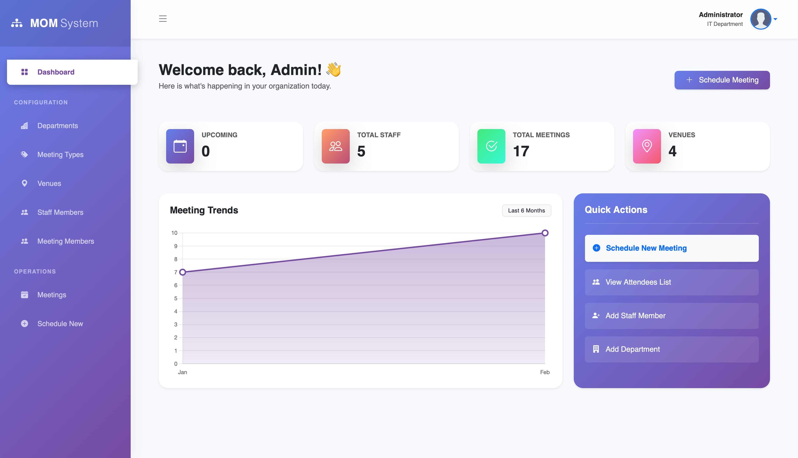
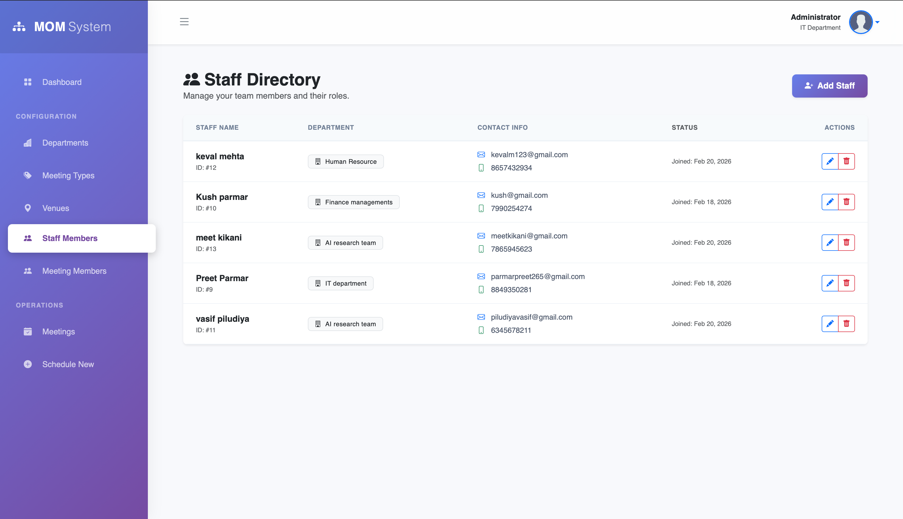
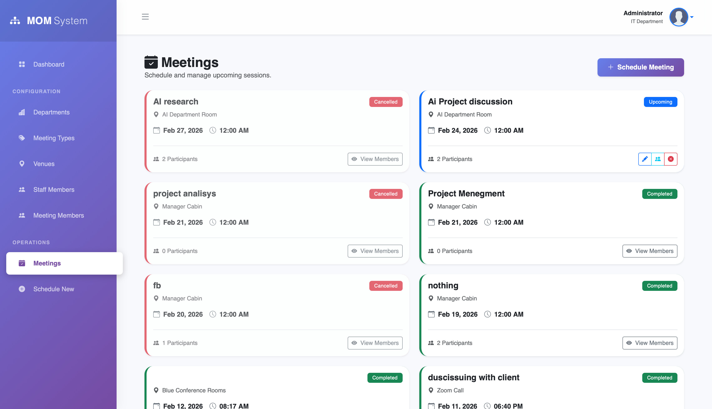
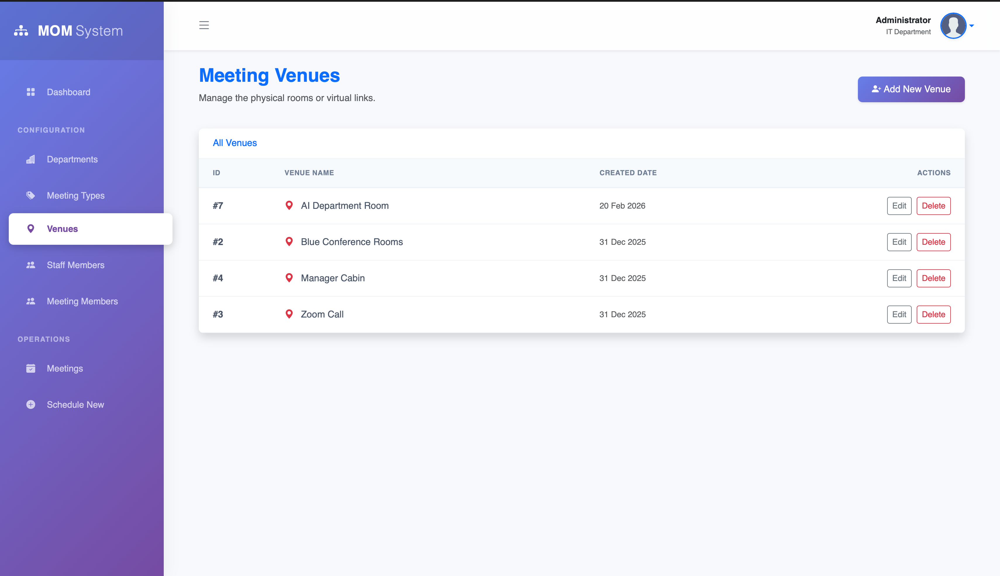
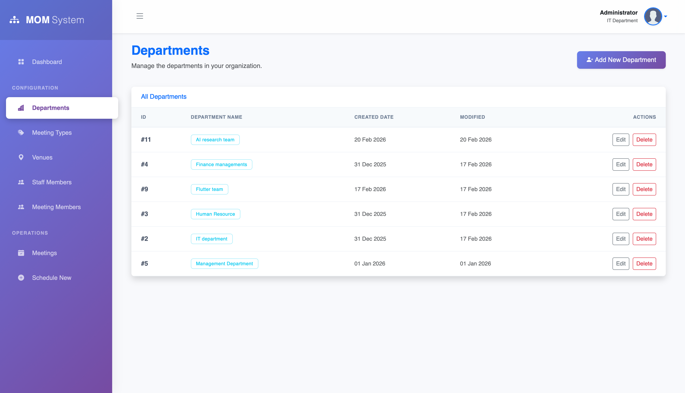
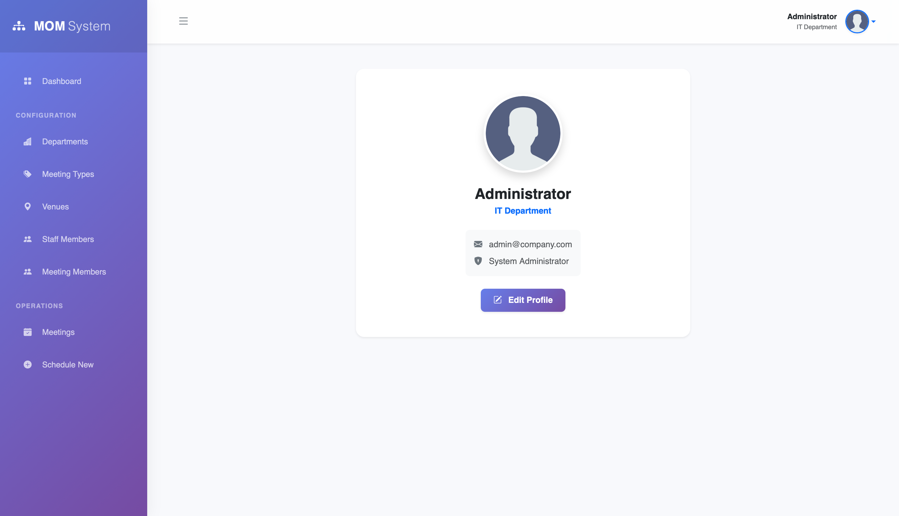
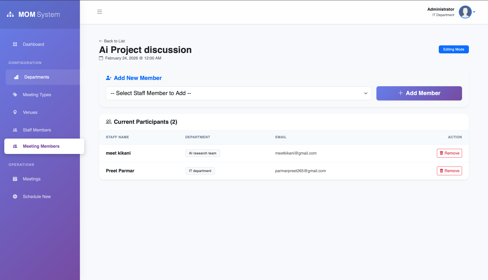

# 📅 Minutes of Meeting (MOM) System
**A professional .NET-based management solution with a modern Glassmorphism UI.**

This project is a specialized scheduling and management system designed to streamline corporate and academic meetings. It features a robust backend built on .NET and a high-fidelity dashboard for administrative control.

---

## 📸 System Showcase
I have designed the interface to be both functional and visually striking, utilizing modern UI trends to enhance user experience.

| 🖥️ Admin Dashboard | 👥 Staff Directory |
| :---: | :---: |
|  |  |
| *High-level overview of system activity* | *Management of all registered staff members* |

| 📅 Meeting Scheduling | 📍 Venue Management |
| :---: | :---: |
|  |  |
| *Dynamic scheduling with conflict check* | *Configuring meeting rooms and capacities* |

| 🏷️ Meeting Types | 🏬 Meeting Departments |
| :---: | :---: |
|  |  |
| *Categorizing sessions (AI, Research, etc.)* | *Capturing key notes and session outcomes* |

| 👤 User Profiles | 👬 Meeting Members |
| :---: | :---: |
|  |  |
| *Individual host and participant roles* | *Backend setup and administrative tools* |

---

## 🚀 Key Features
* **Role-Based Access:** Distinct functionalities for Hosts and Participants.
* **Dynamic Scheduling:** Create, edit, and cancel meetings with real-time updates.
* **Advanced Tracking:** Manage venues, departments, and specific meeting types.
* **Modern UI:** Built with a "Glassmorphism" aesthetic for a clean, professional feel.

## 🛠️ Tech Stack
* **Framework:** .NET (C#)
* **Frontend:** Razor Pages / Modern CSS (Glassmorphism)
* **Database:** MySQL Server
* **Architecture:** Model-View-Controller (MVC) logic

## 💻 Installation
1. Clone the repository: `git clone https://github.com/Preet260507/MinutesOfMeeting.git`
2. Open the solution file in **Visual Studio**.
3. Update the connection string in `appsettings.json` to your local MySQL instance.
4. Press `F5` to build and run.
